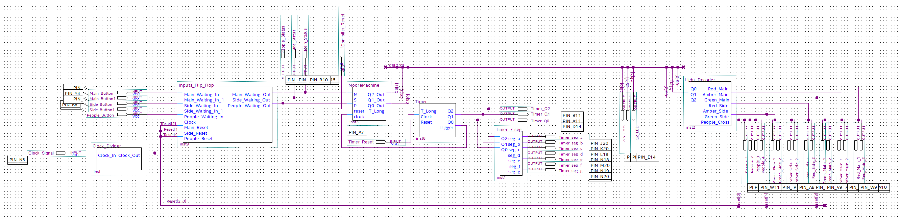

# Traffic Light Controller
This project was made for my university coursework, using Quartus Prime to create a traffic light controller. This included main and side roads as well as pedestrian crossings with presense detection. This was made to run on a DE10-Lite board

## How It's Made:

To be continued...

